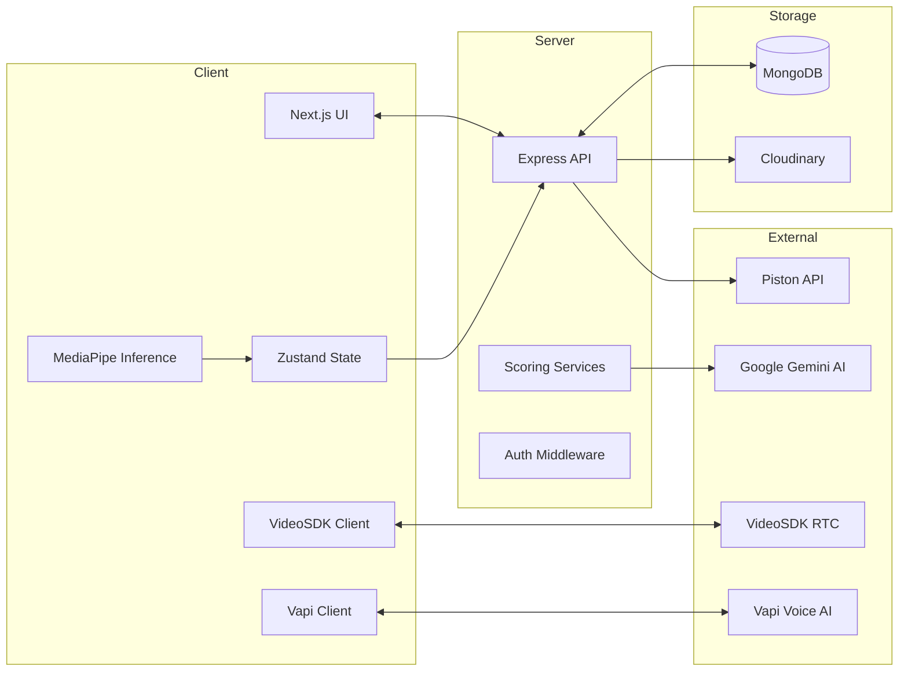
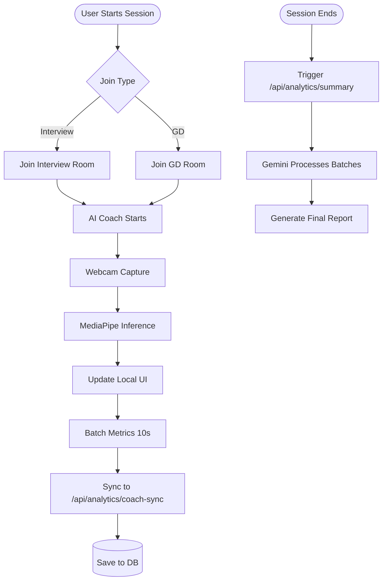
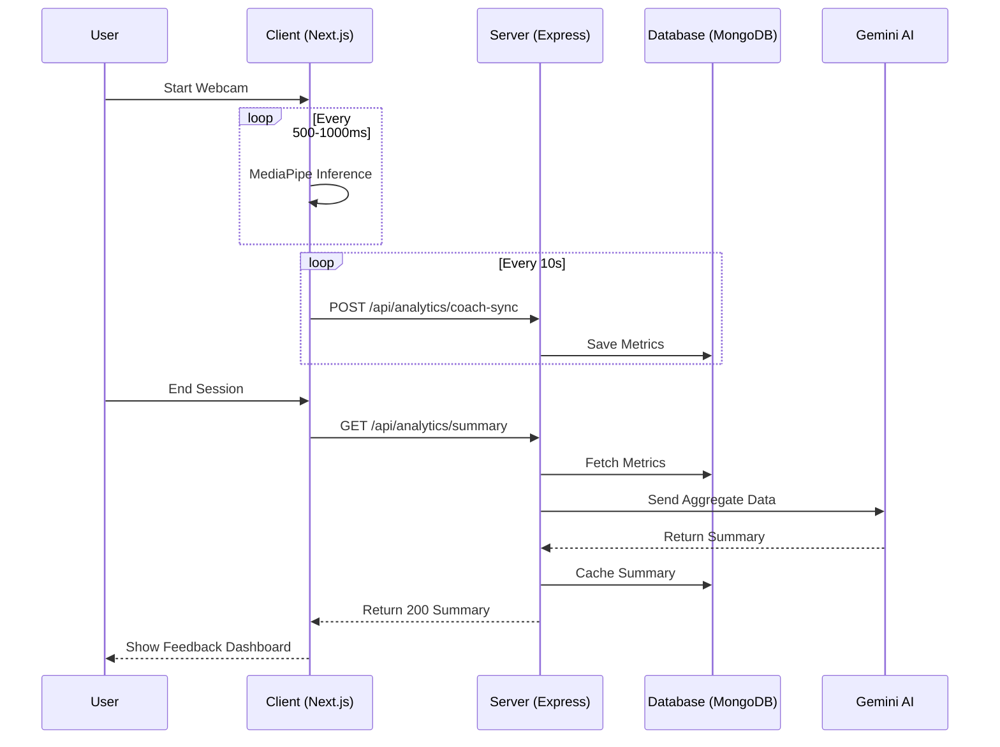
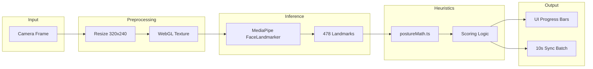

# 📘 PROJECT DOCUMENTATION

---

# 1. 🧠 Project Overview (Beginner Level)

### 🟢 Beginner View
InteractAI is an intelligent platform designed to help people practice and improve their interview and group discussion skills. It uses AI "bots" that talk to you like real recruiters and a "Coach" that watches your body language and eye contact to give you helpful tips in real-time.

### 🟡 Intermediate View
The platform is a comprehensive assessment ecosystem that automates the screening process. It features a Voice AI for one-on-one interviews, a multi-participant Video room for Group Discussions (GD), and a Computer Vision-based behavioral coach. It bridges the gap between practice and real-world placement by providing data-driven performance metrics.

### 🔴 Advanced View
InteractAI is a high-performance distributed system consisting of a Next.js frontend and a Node.js/Express backend. It leverages **WebRTC** (via VideoSDK) for multi-party communication, **MediaPipe** for client-side edge inference, and **Google Gemini** for asynchronous qualitative analysis. The architecture is designed for low latency and high scalability by offloading compute-intensive AI tasks to the browser.

---

# 2. 🧩 System Architecture (Intermediate)

### 🟢 Beginner View
The project has three main parts: the Website (what you see), the Server (the brain that saves your data), and the AI Services (the parts that talk and think).

### 🟡 Intermediate View
- **Frontend**: Next.js 15 with App Router. Uses **Zustand** for global state management and **Tailwind CSS** for styling.
- **Backend**: Express.js server running on Node.js.
- **Database**: MongoDB (Atlas) for persistent storage.
- **External Services**: 
  - **VideoSDK**: For real-time video/audio rooms.
  - **Vapi**: For AI Voice agent interaction.
  - **Cloudinary**: For storing user uploads.
  - **Piston**: For sandboxed code execution.

### 🔴 Advanced View
The system follows a **Decoupled Service Architecture**. The frontend communicates with the backend via a RESTful API secured by **JWT**. Real-time interactions are handled through a combination of WebSocket-based signaling (VideoSDK) and Voice-over-IP (Vapi). The backend utilizes a Service-Layer pattern (e.g., `gdScoringService.ts`, `behavioralSummaryService.ts`) to isolate business logic from route controllers.

---

# 3. 🔁 Data Flow (Step-by-step)

### 🟢 Beginner View
1. You turn on your camera.
2. The AI Coach looks at your face.
3. It shows you a message like "Great Eye Contact!"
4. At the end, it writes a report for you.

### 🟡 Intermediate View
1. **Camera Feed**: Local stream captured via `getUserMedia`.
2. **Inference**: MediaPipe analyzes frames every 500ms-1000ms.
3. **Local State**: Zustand updates with current metrics.
4. **Batch Sync**: Every 10s, metrics are sent to `/api/analytics/coach-sync`.
5. **Summarization**: After session, Gemini analyzes batches to create a summary.

### 🔴 Advanced View
The data pipeline is optimized for **Zero-Latency Feedback**. 
`Webcam` → `Canvas (320x240)` → `MediaPipe FaceLandmarker (GPU Delegate)` → `postureMath.ts (Heuristics)` → `Zustand Store`. 
The client-side `useAnalyticsSync` hook implements a **Throttled Batching Strategy** using `keepalive: true` fetch requests to ensure data integrity during session termination. The backend processes these batches asynchronously to avoid blocking the API response thread.

---

# 4. 📦 Modules Breakdown (Beginner → Advanced)

## 4.1 AI Coach Module
- **Beginner**: A little helper in the corner of your screen that tells you to sit straight and look at the camera.
- **Intermediate**: A Computer Vision system using MediaPipe to track 478 face landmarks.
- **Advanced**: Implemented in `src/hooks/useMediaPipe.ts`. Uses a main-thread dynamic import strategy to load WASM binaries. Calculations for eye contact and posture are done via 3D vector geometry in `postureMath.ts`.

## 4.2 Group Discussion (GD) Module
- **Beginner**: A video room where you can talk to other people while an AI moderator guides the conversation.
- **Intermediate**: A multi-party RTC environment powered by VideoSDK with a Vapi AI Moderator injected as a participant.
- **Advanced**: Managed in `VideoSDKMeeting.tsx`. Orchestrates participant state, turn-taking logic, and moderator intervention via `gdScoringService.ts`.

## 4.3 AI Interviewer
- **Beginner**: A voice agent that asks you interview questions and listens to your answers.
- **Intermediate**: A low-latency voice AI integrated via Vapi, customized for different job roles.
- **Advanced**: Utilizes `Agent.tsx` and the Vapi Client SDK. Connects to backend templates to inject role-specific prompts into the AI's system message.

---

# 5. 🧠 AI / ML / LLM Layer

### 🔴 Advanced View
- **MediaPipe (Local ML)**: Runs `face_landmarker.task` in the browser. Detects iris orientation and head transformation matrices.
- **Google Gemini (LLM)**: Used for high-level reasoning. Prompts are strictly structured to avoid psychological diagnosis and focus on objective physical presence (see `behavioralSummaryService.ts`).
- **Vapi (Voice AI)**: Handles STT (Speech-to-Text), LLM reasoning, and TTS (Text-to-Speech) with <500ms latency.

---

# 6. 🤖 RAG / Vector DB
- **Status**: Not implemented in current project.

---

# 7. 🗄 Database Design (ER-Level Explanation)

### 🔴 Advanced View
- **User**: Stores profiles, XP, streaks, and credentials.
- **Interview**: Metadata for individual sessions.
- **GDSession**: Stores participants, transcripts, and group analytics (synergy, dominance).
- **BehavioralAnalytics**: High-frequency snapshots (timestamped).
- **BehavioralSummary**: AI-generated reports linked to sessions.

---

# 8. ⚙️ API Layer

### 🔴 Advanced View
- `POST /api/analytics/coach-sync`: Batched metric intake.
- `GET /api/analytics/summary/:sessionId/:participantId`: Polls for Gemini summary.
- `GET /api/gd/results/:sessionId`: Comprehensive group performance report.
- `POST /api/code/execute`: Sandboxed Piston judge interaction.

---

# 9. 📊 Business Logic Flow

### 🟢 Beginner View
InteractAI helps companies find the best candidates by letting the AI do the first round of interviews. This saves time and ensures everyone gets a fair chance.

### 🟡 Intermediate View
The system delivers value by converting subjective human behaviors into objective data points. By ranking candidates based on technical accuracy and behavioral stability, it provides a "Ready-to-Hire" score.

---

# 10. 🧪 Advanced System Understanding

- **Real-time**: VideoSDK signaling handles participant join/leave events to ensure the AI moderator always knows who is in the room.
- **WASM Stability**: Implemented a **Global Singleton Pattern** for MediaPipe landmarker and resolver. This prevents resource conflicts and memory corruption caused by React 18 Strict Mode double-initialization.
- **Timestamp Accuracy**: Implemented monotonic timestamp validation to prevent MediaPipe inference crashes caused by non-increasing performance.now() values.
- **Resource Persistence**: By maintaining a persistent global landmarker, the system avoids the overhead of reloading WASM binaries and models during page transitions.

---

# 11. 📌 Change Log (AUTO UPDATED)

### [2026-05-07] - AI Coach Phase 5 Implementation
- **Added**: Real-time behavioral coaching with MediaPipe.
- **Added**: Progress-bar based UI for live feedback.
- **Added**: Backend analytics sync and Gemini-powered summaries.
- **Added**: Integration into both AI Interview and GD rooms.
- **Fixed**: Web Worker / Turbopack compatibility issues via dynamic import strategy.
- **Fixed**: MediaPipe WASM crash by hardening landmarker lifecycle and adding strictly increasing timestamp validation.
- **Improved**: Migrated MediaPipe to a Global Singleton architecture to ensure stability in Next.js Dev/Strict mode.

---

# 12. 📊 SYSTEM DIAGRAMS (MERMAID)

### 12.1 System Architecture

### 12.2 Flowchart (User / API flow)

### 12.3 Sequence Diagram (AI Coach Sync)

### 12.4 AI / ML Pipeline Diagram

